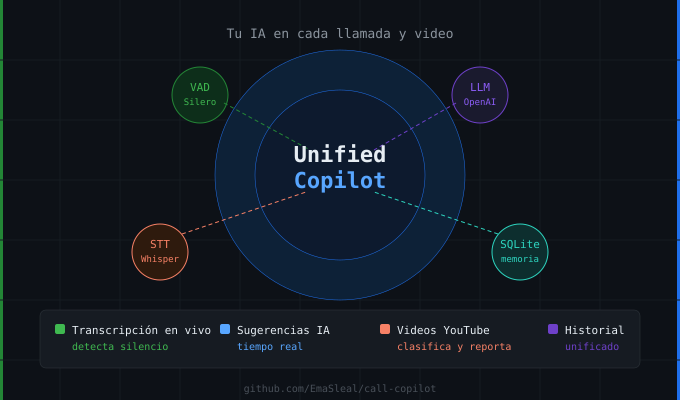

# Call Copilot



TUI (Textual) que corre en paralelo dos flujos: **Call Copilot** (transcripción
en vivo + sugerencias de un LLM, disparadas por fin de turno o pregunta
detectada) y **Video Transcriber** (bajar un video de YouTube, transcribirlo,
clasificarlo por categoría y generar un reporte HTML). Comparten la misma base
SQLite y la misma pantalla.

## Arquitectura

```
AudioSource ──► VAD (Silero) ──► STTProvider ──► TriggerDetector ──► LLMProvider ──► OutputSink
(Pulse/WASAPI)   (fin de turno)   (Deepgram/         (pregunta /                      (TUI en vivo)
                                    Whisper local)     silencio)
```

Cada bloque está definido como interfaz en `src/core/interfaces.py`. El
pipeline (`src/core/pipeline.py`) orquesta sin conocer implementaciones
concretas — la elección de provider concreto vive en `src/tui/bootstrap.py`
(usado por la TUI) y, para el modo sin TUI, en `main.py`.

### La TUI (`src/tui/app.py`) — uso normal

Seis tabs, todas sobre la misma base de datos:

| Tab | Qué hace |
|---|---|
| **[1] Call Copilot** | Transcripción en vivo de una llamada + sugerencias del LLM en tiempo real. Perfil activo, selector de dispositivo de audio, botón de Configuración. |
| **[2] Video** | Pega una URL de YouTube, la transcribe, clasifica los segmentos por categoría y genera el reporte HTML. |
| **[3] Buscar** | Full-text search sobre los segmentos ya clasificados. |
| **[4] Categorías** | CRUD de la taxonomía compartida entre video y llamadas. |
| **[5] Historial** | Sesiones de video y de llamada unificadas (vista `unified_sessions`/`unified_segments` en SQLite), con columna de origen. |
| **[6] Tools** | Catálogo de tecnologías/herramientas mencionadas en las llamadas, extraídas automáticamente post-sesión (`src/processing/tool_extractor.py`). Lista todo por default; búsqueda semántica (RAG) si hay `OPENAI_API_KEY` configurada. |

`Ctrl+S` abre el panel de **Configuración** (modal) desde cualquier tab:
proveedor LLM/STT en tiempo real, API keys (OpenAI/Anthropic/Deepgram),
tamaño de modelo Whisper por uso, el umbral de silencio del VAD, y un botón
para importar el catálogo de Tools desde una base externa (tech-scout, un
proyecto personal separado) — todo persistido directo a `.env`.

### `main.py` — modo alternativo sin TUI

Pipeline de consola equivalente, sin Textual — útil para debug rápido o si
no querés la interfaz. Mismas variables de entorno, misma lógica de
selección de provider (duplicada intencionalmente respecto a
`src/tui/bootstrap.py`: son dos entrypoints independientes, no una capa
compartida).

## Por qué estas decisiones

- **VAD real (Silero), no timeout fijo.** El trigger genuino es "la otra
  persona dejó de hablar", no "pasaron N segundos" ni "se acumularon N
  oraciones". El umbral de silencio (`SILENCE_THRESHOLD_MS`, default 2000ms)
  es configurable desde el panel de Configuración, pero requiere reiniciar
  la app — queda congelado en un singleton cargado antes de que Textual
  abra la terminal (`src/tui/bootstrap.py::_preload_models`).
- **Heurística de pregunta sin LLM extra.** Regex + signos de interrogación
  dispara en microsegundos. Una confirmación vía LLM agregaría latencia
  perceptible en una llamada en vivo.
- **STT intercambiable desde el día uno.** `STT_BACKEND=deepgram` para
  latencia mínima en la nube, `STT_BACKEND=whisper_local` para correr local
  sin costo recurrente ni dependencia de red. Mismo contrato
  (`STTProvider`), cero cambios en el resto del pipeline.
- **Audio de captura intercambiable por SO.** `PulseLoopbackSource` en Linux
  (con selector manual de sink desde la TUI — el sink "default" del sistema
  puede no ser el que realmente está sonando), `WASAPILoopbackSource` en
  Windows. Mismo contrato `AudioSource`.
- **Claude Haiku, no Sonnet/Opus, cuando `LLM_BACKEND=claude`.** Para una
  sugerencia de 2-3 oraciones en tiempo real, la latencia importa más que
  el razonamiento profundo. Con `LLM_BACKEND=gpt` (default) la elección es
  dinámica: nano/mini según `LLM_TOKEN_THRESHOLD`.
- **Streaming obligatorio en el LLM.** Ver las primeras palabras mientras
  el modelo sigue generando es la diferencia entre "útil en vivo" y
  "llegó tarde a la conversación".
- **Perfiles de llamada** (`src/profiles/`) — cada perfil define su propio
  `system_prompt_addon`, heurísticas de modo conservador, `response_mode` y
  override de modelo opcional. Gestionables desde la TUI sin editar código.
- **RAG opcional** (`src/rag/chroma_store.py`) — ChromaDB + embeddings de
  OpenAI para dar contexto de sesiones pasadas al LLM durante la llamada.

## Instalación

Sin clonar el repo — instala como comando global vía [pipx](https://pipx.pypa.io)
(el script clona internamente):

```bash
curl -fsSL https://raw.githubusercontent.com/EmaSleal/call-copilot/linux-support/install.sh | sh
```

Pregunta qué perfil instalar y arma el comando `call-copilot`. Config y
datos quedan en `~/.call-copilot/`, no en el directorio del repo.

| Perfil | Incluye |
|---|---|
| Mínimo (default) | solo llamadas en vivo (Deepgram + GPT/Claude/Ollama) |
| Completo | + Whisper local (STT), procesamiento de video, catálogo de tools con RAG |
| A mano | elegís cada extra por separado |

También instalable directo con los extras de `pyproject.toml` (`whisper-local`,
`video`, `rag`, o `full` para los tres):

```bash
pipx install "call-copilot[whisper-local,video,rag] @ git+https://github.com/EmaSleal/call-copilot.git@linux-support"
```

### Comandos

| Comando | Qué hace |
|---|---|
| `call-copilot` | arranca la TUI |
| `call-copilot --help` | lista los comandos (`-h` / `help` también andan) |
| `call-copilot version` | versión y commit instalado |
| `call-copilot check-update` | avisa si hay una versión nueva, sin instalarla |
| `call-copilot update` | instala la última versión |
| `call-copilot doctor` | diagnóstico: pipx, Python, extras opcionales, GPU/CUDA |
| `call-copilot uninstall` | desinstala (config/datos en `~/.call-copilot` quedan) |

## Setup (desde el repo, para desarrollo)

```bash
pip install -r requirements.txt
```

Copiá `example.env` a `.env` y completá lo que necesites, o arrancá la app
y configurá todo desde el panel de Configuración (`Ctrl+S`) — se persiste
solo a `.env`.

Siempre necesario: la API key del `LLM_BACKEND` que elijas
(`OPENAI_API_KEY` o `ANTHROPIC_API_KEY`). Si usás `STT_BACKEND=deepgram`,
también `DEEPGRAM_API_KEY`. `STT_BACKEND=whisper_local` no necesita key,
pero la primera ejecución descarga el modelo configurado.

## Correr

```bash
./run.sh                # crea/activa el venv e inicia la TUI
# o, con el venv ya activado:
python src/tui/app.py

# modo consola, sin TUI:
python main.py
```

## Base de datos

SQLite en `data/app.db` corriendo desde el repo, o `~/.call-copilot/data/app.db`
si instalaste vía pipx/`install.sh` (`src/core/paths.py` resuelve cuál según
si hay un checkout de git al lado del código corriendo). Siete tablas —
`categories`, `video_sessions`, `segments`, `call_sessions`,
`call_segments`, `tools`, `tool_mentions` — más dos vistas de solo lectura
(`unified_segments`, `unified_sessions`) que unifican video y llamadas para
el tab Historial. `categories` es la única taxonomía realmente compartida
entre video y llamadas; `video_sessions` y `call_sessions` son secuencias de
id independientes. `tools`/`tool_mentions` alimentan el tab Tools — un tool
mencionado en varias llamadas es una sola fila en `tools` con una
`tool_mention` por cada mención (nunca se pisa el enriquecimiento del LLM).

## Pendiente / próximos pasos

1. **Captura de pestaña de navegador (`tabCapture`)** — no implementada.
   En la práctica, `PulseLoopbackSource`/`WASAPILoopbackSource` ya capturan
   el audio de salida a nivel de sistema operativo, así que una llamada por
   navegador ya se graba igual. Un `tabCapture` real (vía extensión de
   Chrome) solo aportaría algo si necesitás aislar una pestaña específica
   cuando hay más de una sonando a la vez — es una arquitectura distinta
   (extensión + servidor local), no una clase más de `AudioSource`.
2. **TTS como `OutputSink` alternativo** — hoy la única salida es la TUI en
   vivo (`TUIOutput` en `src/tui/tabs/call.py`). Un overlay flotante o TTS
   quedan como opciones no exploradas, sin que nada del código bloquee
   agregarlas (`OutputSink` es una interfaz chica).
3. **Tuning de `SILENCE_THRESHOLD_MS`** — ya expuesto en el panel de
   Configuración (rango 100-5000ms, default 2000), pero el valor correcto
   sigue dependiendo de cómo hablás vos y con quién — ajustar
   empíricamente una vez que esté corriendo.
